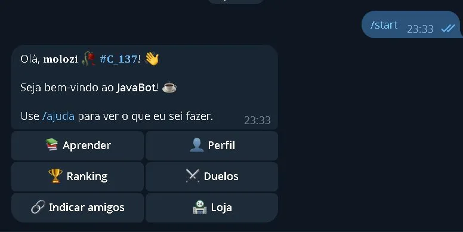
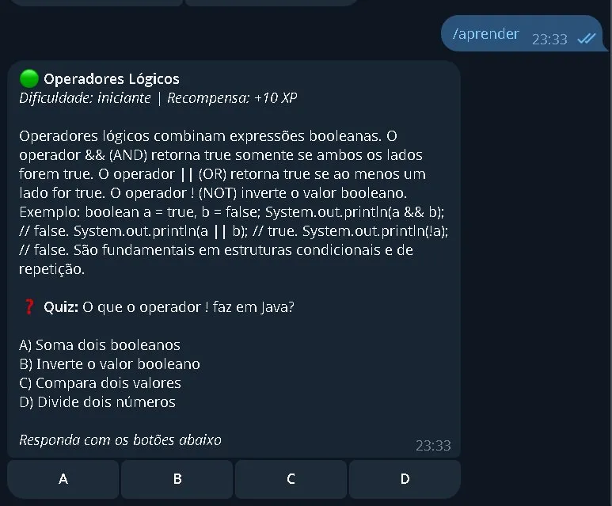
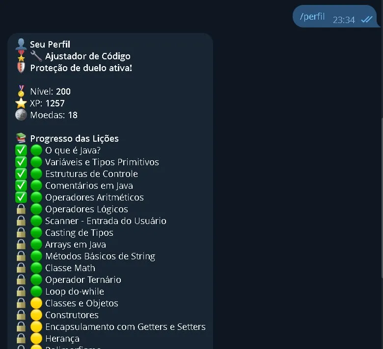
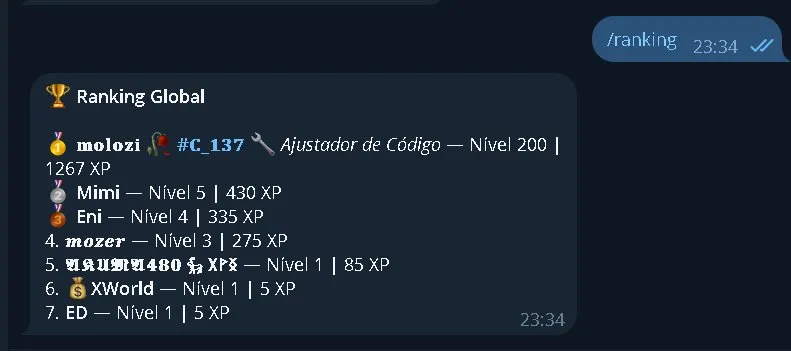
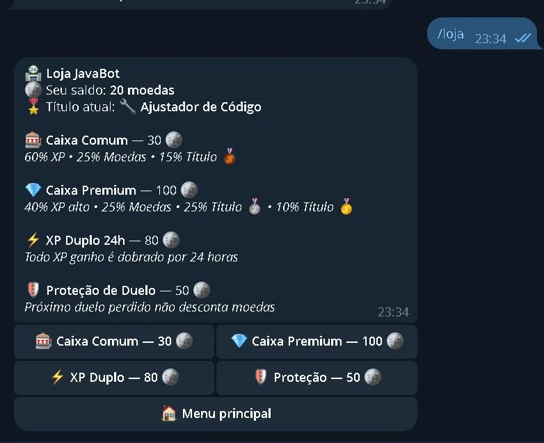
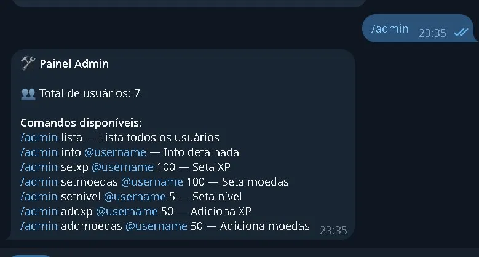

# ☕ JavaBot

> A Telegram bot for learning Java through gamification — XP, coins, duels, rankings and a store.  
> Um bot do Telegram para aprender Java com gamificação — XP, moedas, duelos, ranking e loja.

<p align="center">
  
  
  
  
  
</p>

---

## 📸 Preview

| /start                    | /aprender                       | /perfil                     |
|---------------------------|---------------------------------|-----------------------------|
|  |  |  |

| /ranking                      | /loja                   | /admin                    |
|-------------------------------|-------------------------|---------------------------|
|  |  |  |

---

## ✨ Features

- 📚 **30+ Java lessons** organized by difficulty (beginner → advanced)
- ❓ **Multiple choice quiz** after each lesson with XP rewards
- ⚔️ **Duel system** — challenge other users with coin bets, inline A/B/C/D buttons, auto-expiry in 1 hour
- ⭐ **XP & leveling system** — gain XP by studying, answering quizzes and winning duels
- 🪙 **Coin economy** — earn coins by interacting, spend in the store
- 🏆 **Global ranking** with exclusive titles displayed next to usernames
- 🏪 **Store** with Common Box, Premium Box, 24h XP Boost and Duel Shield
- 🎖️ **Exclusive titles** with bronze / silver / gold rarity drops
- 🔗 **Referral system** — share your unique link and earn XP + coins for each friend
- 👤 **Profile** with progress bar, active titles and effects
- 🛠️ **Admin panel** — list users, set XP/coins/level for any user
- 💬 **Group & topic support** — duels and lessons work in Telegram groups with topics
- 🔔 **Auto duel expiry** — returns coins automatically after 1 hour with no response

---

## 🛠️ Tech Stack

| Technology | Purpose |
|------------|---------|
| Java 17 | Core language |
| TelegramBots 6.9 | Telegram Bot API |
| MySQL 8 | Database |
| HikariCP 5.1 | Connection pool |
| dotenv-java | Environment config |
| Maven | Build & dependency management |

---

## 📁 Project Structure

```
src/main/java/fiorentin/dev/
├── Main.java                     ← Entry point
├── bot/
│   ├── MeuBot.java               ← Receives and routes updates
│   ├── CommandHandler.java       ← All command logic
│   ├── AdminHandler.java         ← Admin commands
│   ├── Teclado.java              ← Inline keyboard builder
│   └── DueloExpiracaoService.java ← Auto duel expiry scheduler
├── db/
│   ├── Database.java             ← HikariCP connection pool
│   ├── UsuarioDAO.java           ← User queries
│   ├── LicaoDAO.java             ← Lesson queries
│   ├── PerguntaDAO.java          ← Quiz queries
│   ├── DueloDAO.java             ← Duel queries
│   └── LojaDAO.java              ← Store & items queries
└── model/
    ├── Usuario.java
    ├── Licao.java
    ├── LicaoProgresso.java
    ├── Pergunta.java
    └── Duelo.java
```

---

## 🚀 Getting Started

### Prerequisites

- Java 17+
- Maven 3.8+
- MySQL 8+
- A Telegram bot token from [@BotFather](https://t.me/BotFather)

### 1. Clone the repository

```bash
git clone https://github.com/devfiorentin/javabot.git
cd javabot
```

### 2. Create the database

```bash
mysql -u root -p < banco/schema.sql
```

### 3. Configure environment variables

```bash
cp .env.example .env
```

Edit `.env`:

```env
BOT_TOKEN=your_token_here
BOT_USERNAME=YourBotUsername
DB_HOST=localhost
DB_PORT=3306
DB_NAME=javabot
DB_USER=root
DB_PASSWORD=your_password
ADMIN_ID=your_telegram_id
```

### 4. Build and run

```bash
mvn clean package -q
java -jar target/telegram-bot-1.0-SNAPSHOT.jar
```

---

## 💬 Commands

| Command | Description |
|---------|-------------|
| `/start` | Welcome message + main menu |
| `/aprender` | Next Java lesson with quiz |
| `/perfil` | Your level, XP, coins and progress |
| `/ranking` | Top 10 players |
| `/loja` | Spend coins on items and boxes |
| `/indicar` | Get your referral link |
| `/duelar @user 50` | Challenge someone with a coin bet |
| `/cancelarduelo` | Cancel your pending duel |
| `/sobre` | Bot info |
| `/ajuda` | Command list |

---

## 🏪 Store Items

| Item | Price | Effect |
|------|-------|--------|
| 🎰 Common Box | 30 🪙 | 60% XP · 25% Coins · 15% Bronze title |
| 💎 Premium Box | 100 🪙 | 40% XP · 25% Coins · 25% Silver · 10% Gold title |
| ⚡ XP Boost 24h | 80 🪙 | Double XP for 24 hours |
| 🛡️ Duel Shield | 50 🪙 | Next lost duel won't deduct coins |

---

## ⚔️ Duel Flow

```
/duelar @user 50
  → Group: "Waiting for user to accept..."
  → Target's DM + Group: [Accept] [Refuse] buttons

Target accepts
  → Group: question appears with A B C D buttons for both players
  → Each player responds once (can't change answer)
  → When both respond → result shown in group
  → Auto-cancelled after 1 hour if ignored
```

---

## 📝 License

MIT — feel free to use, modify and distribute.

---

## 👨‍💻 Author

Made with ☕ by [devfiorentin](https://github.com/devfiorentin)  
First Java project — built from scratch learning as I go.